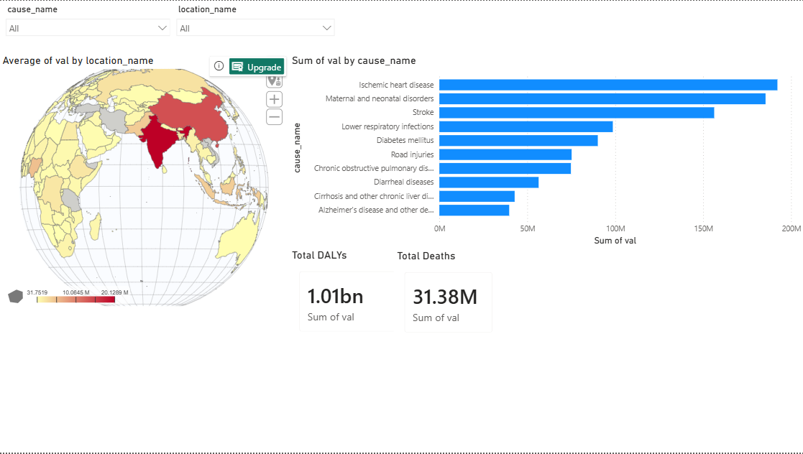
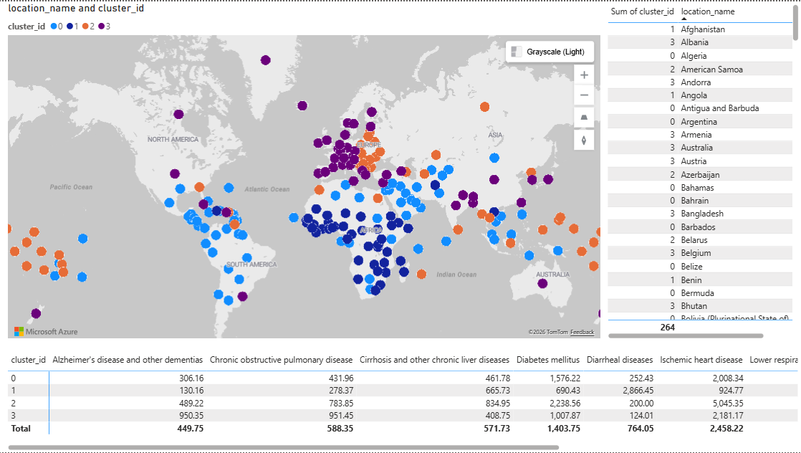
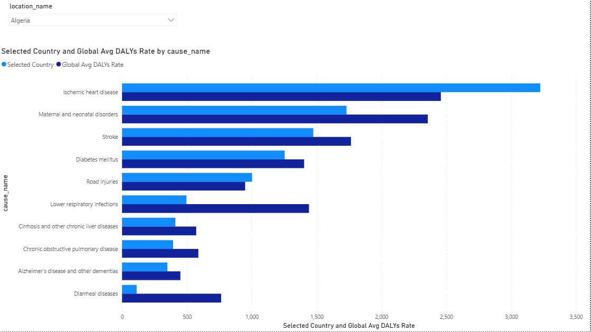
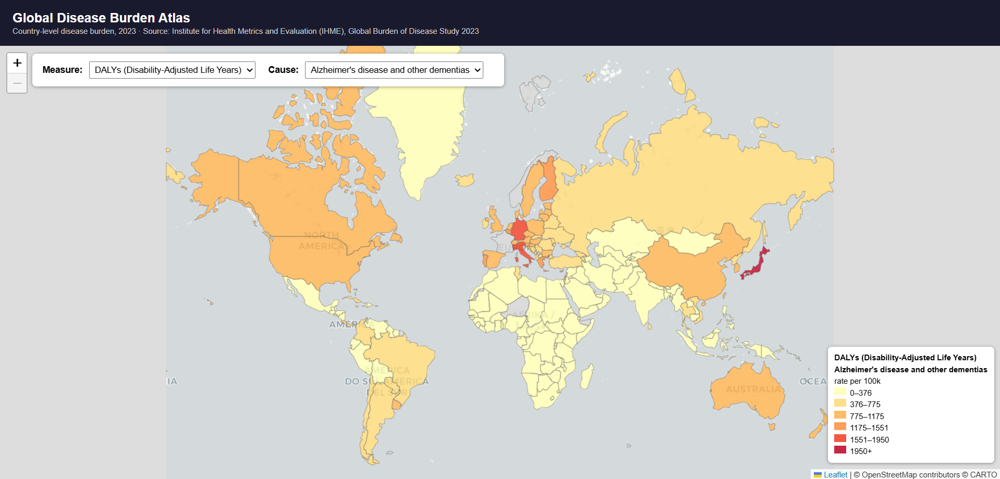

# Global Disease Burden Atlas

An end-to-end data pipeline and dashboard exploring global disease burden across 204 countries, built on the Institute for Health Metrics and Evaluation's (IHME) Global Burden of Disease Study 2023.

## What this project does

Starting from raw public health data, this project:
- Structures 16,320 records of disease burden data into a SQL Server star schema
- Maps country-level burden interactively (Leaflet/GeoPandas) and in Power BI
- Clusters countries by their disease burden "fingerprint" using K-Means, surfacing a pattern that closely resembles the epidemiological transition
- Presents findings in a 3-page Power BI dashboard

## Data

**Source:** [IHME Global Burden of Disease Study 2023](https://vizhub.healthdata.org/gbd-results/)

**Scope (v1):**
- Top 10 causes of death: ischemic heart disease, stroke, COPD, lower respiratory infections, neonatal disorders, diarrheal diseases, road injuries, diabetes mellitus, Alzheimer's/dementia, cirrhosis
- All available countries (204)
- Year: 2023
- Measures: Deaths, DALYs, YLDs, YLLs
- Metrics: Number, Rate (per 100,000)

## Architecture

```
Raw CSV (IHME GBD export)
        │
        ▼
SQL Server star schema (fact_disease_burden + 6 dimension tables)
        │
        ├──► GeoPandas + Leaflet.js  → interactive choropleth map (dashboards/disease_burden_map.html)
        ├──► scikit-learn K-Means    → country_cluster table (4 clusters)
        └──► Power BI                → 3-page dashboard
```

### Star schema

- `fact_disease_burden` — 16,320 rows: cause × location × measure × metric × age × sex × year
- `dim_cause`, `dim_location` (+ ISO3 codes for map joins), `dim_measure`, `dim_metric`, `dim_age`, `dim_sex`
- `country_cluster` — K-Means cluster assignment per country

## Key finding: the epidemiological transition, unsupervised

Clustering countries purely on their DALYs rate profile across the 10 causes (no labels, no region input) recovers a pattern matching the well-documented epidemiological transition:

| Cluster | Profile | Example countries |
|---|---|---|
| 1 | Very high maternal/neonatal and infectious disease burden | DRC, CAR, Burundi, Afghanistan, Haiti |
| 0 | Moderate, transitional burden | Cambodia, Vietnam, Philippines, Malaysia |
| 2 | High cardiovascular/metabolic burden | Indonesia, Myanmar, Thailand, Pacific Islands |
| 3 | Aging-population, chronic-disease-dominant | China, Japan, South Korea, Czechia, Australia |

k=4 was chosen over the statistically stronger k=3 (silhouette 0.222 vs 0.272) for the richer narrative it surfaces — see `notebooks/elbow_plot.png` for the full comparison.

## Dashboard






Three-page Power BI report (`dashboards/`):

1. **Overview** — KPI totals, choropleth map, ranked bar chart of causes, cause/measure filters
2. **Clusters** — categorical cluster map, country-to-cluster lookup, cluster burden profile matrix
3. **Country Detail** — pick any country, compare its DALYs profile against the global average

## Tech stack

- **Data:** IHME GBD 2023
- **Database:** SQL Server (star schema, ~16K fact rows)
- **ETL:** Python (pandas, sqlalchemy, pyodbc)
- **Geospatial:** GeoPandas, Leaflet.js, Natural Earth
- **Clustering:** scikit-learn (K-Means, StandardScaler, silhouette analysis)
- **Dashboard:** Power BI (DAX measures, Shape Map, Matrix visuals)

## Repo structure

```
global-disease-burden-atlas/
├── data/
│   ├── raw/           # original IHME export
│   └── processed/     # cleaned/derived data
├── sql/                # schema DDL
├── src/                # Python: load_data.py, add_iso3.py, build_map.py, cluster_countries.py
├── notebooks/           # elbow_plot.png and exploratory work
├── dashboards/          # disease_burden_map.html, .pbix
└── README.md
```

## Running it yourself

1. Run `sql/01_create_database.sql` then `sql/02_create_schema.sql` against your SQL Server instance
2. Place a GBD export CSV in `data/raw/`
3. `python src/load_data.py` — loads the star schema
4. `python src/add_iso3.py` — adds ISO3 codes for mapping
5. `python src/build_map.py` — generates the interactive Leaflet map
6. `python src/cluster_countries.py` — run once with `CHOSEN_K = None` for the elbow plot, then set `CHOSEN_K` and re-run for final clusters
7. Open `dashboards/*.pbix` in Power BI Desktop and refresh the data source

## Data citation

Global Burden of Disease Collaborative Network. Global Burden of Disease Study 2023 (GBD 2023) Results. Seattle, United States: Institute for Health Metrics and Evaluation (IHME), 2024.
